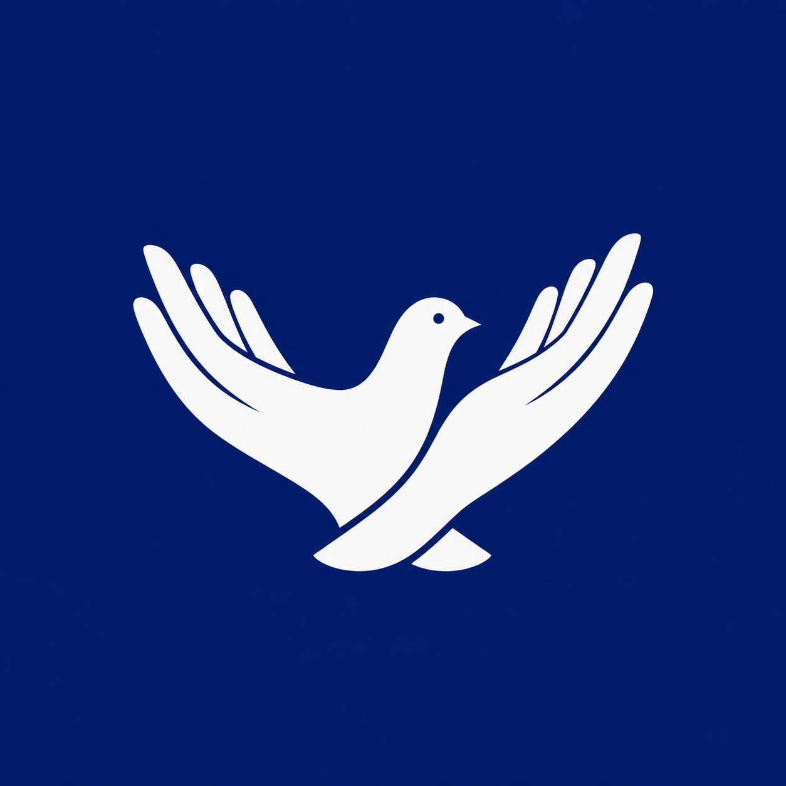

<div align="center">



# CIS · Centro de Convivência Ação e Paz

**Site institucional de uma ONG que há mais de 30 anos acolhe crianças no Parque Vitória Régia, em Sorocaba/SP.**

[](https://luanrennanb15.github.io/Ong-Centro-de-convivencia-acao-e-paz/)


</div>

---

## 💙 Sobre o projeto

O **Centro de Convivência Ação e Paz (CIS)** é uma entidade **sem fins lucrativos** que, há mais de três décadas, oferece um espaço seguro e afetuoso para crianças no contraturno escolar — com atividades educativas, recreativas e culturais que apoiam o desenvolvimento e o futuro de cada uma.

Este site foi feito para dar ao CIS uma presença digital à altura do trabalho que ele faz: apresentar a instituição, contar sua história, mostrar as atividades e os eventos, receber pré-cadastros de matrícula e facilitar o contato de quem quer ajudar — tudo com foco em **acolhimento, transparência e simplicidade**.

> Este é um projeto pessoal e afetivo: o CIS cuidou de mim quando eu era criança, e desenvolver este site foi uma forma de retribuir. 💙

---

## ✨ Funcionalidades

- **Multipágina e responsivo** — 8 páginas com layout que se adapta do computador ao celular, com menu hambúrguer.
- **Contato via WhatsApp inteligente** — os formulários montam uma mensagem automática já preenchida e abrem a conversa; a mensagem muda conforme a intenção (doação, voluntariado, parceria, matrícula).
- **Página de Matrículas** — pré-cadastro que envia os dados pelo WhatsApp, com orientação sobre documentos e uma nota de privacidade (dados sensíveis tratados presencialmente).
- **Galerias e eventos** — carrossel de fotos com efeito de destaque, *lightbox* e calendário anual de celebrações.
- **Sem dinheiro** — a entidade não recebe doações em dinheiro; o site direciona a ajuda para itens, voluntariado e parcerias.
- **Detalhes de experiência** — animações suaves ao rolar (*fade-in*), botão "voltar ao topo", botão flutuante de WhatsApp e respeito a `prefers-reduced-motion`.
- **SEO e compartilhamento** — `sitemap.xml`, `robots.txt`, dados estruturados **schema.org** (organização/NGO com CNPJ, endereço e contato) e *meta tags* Open Graph/Twitter para prévia bonita em redes sociais.

---

## 🛠️ Tecnologias

Construído de propósito **sem frameworks e sem etapa de build** — só o essencial, o que deixa o site leve, rápido e fácil de manter:

- **HTML5** semântico
- **CSS3** com variáveis, Flexbox e Grid (um único arquivo de estilo)
- **JavaScript puro** (vanilla), sem dependências
- **GitHub Pages** para hospedagem

---

## 📂 Estrutura do projeto

```
.
├── index.html          # Página inicial
├── sobre.html          # História, fundador e valores
├── atividades.html     # O que o CIS oferece no dia a dia
├── matriculas.html     # Como matricular + pré-cadastro
├── eventos.html        # Calendário anual e eventos que já aconteceram
├── apoiadores.html     # Parceiros, amigos e voluntários
├── como-ajudar.html    # Doação de itens, voluntariado e parcerias
├── contato.html        # Canais de contato, formulário e mapa
├── css/
│   └── estilo.css      # Todo o estilo do site
├── js/
│   └── script.js       # Menu, carrossel, lightbox, formulários, animações
├── imagens/            # Logo e fotos (acervo do CIS)
├── sitemap.xml         # Mapa do site para os buscadores
├── robots.txt          # Regras para os robôs de busca
└── LICENSE             # Licença MIT (código)
```

---

## 🚀 Como rodar localmente

Por ser um site estático, não há nada para instalar. Basta clonar e abrir:

```bash
# clone o repositório
git clone https://github.com/luanrennanb15/Ong-Centro-de-convivencia-acao-e-paz.git
cd Ong-Centro-de-convivencia-acao-e-paz

# opção 1: abra o index.html direto no navegador
# opção 2 (recomendada): suba um servidor local simples
python -m http.server 8000
# depois acesse http://localhost:8000
```

> Dica: no VS Code, a extensão **Live Server** também funciona muito bem para desenvolvimento.

---

## 📄 Páginas

| Página | O que traz |
|---|---|
| **Início** | Apresentação, números e chamada para ajudar |
| **Sobre** | História do CIS, o legado do fundador e os valores |
| **Atividades** | Como é um dia no CIS e a galeria de fotos |
| **Matrículas** | Passo a passo e pré-cadastro pelo WhatsApp |
| **Eventos** | Calendário anual e registros de eventos passados |
| **Apoiadores** | Parceiros, amigos e voluntários (com autorização) |
| **Como Ajudar** | Doação de itens, voluntariado e parcerias |
| **Contato** | Endereço, telefone, e-mail, formulário e mapa |

---

## 🖼️ Direitos de conteúdo

O **código** deste repositório está sob a licença **MIT** — sinta-se livre para estudá-lo e reutilizá-lo.

A **logo, as fotos e o conteúdo institucional** pertencem ao **Centro de Convivência Ação e Paz** e **não estão cobertos pela licença MIT**. Por envolverem a imagem de crianças e da entidade, **não devem ser reutilizados** sem autorização do CIS.

---

## 🙏 Créditos

Feito com carinho por **Luan Rennan**, em retribuição ao CIS.

Toda a gratidão a quem mantém viva essa história: ao fundador **Tio Carlos** *(in memoriam)*, à **Tia Cidinha**, à **Tia Cris**, aos voluntários e aos apoiadores que caminham com as crianças do CIS. 💙

---

## 📬 Contato do CIS

- 🌐 **Site:** [luanrennanb15.github.io/Ong-Centro-de-convivencia-acao-e-paz](https://luanrennanb15.github.io/Ong-Centro-de-convivencia-acao-e-paz/)
- 💬 **WhatsApp:** (15) 99753-1485
- 📘 **Facebook:** [facebook.com/ajudeocis](https://www.facebook.com/ajudeocis/)
- 📍 **Endereço:** R. Prof. Clodomiro Pereira, 213 — Parque Vitória Régia, Sorocaba/SP

<div align="center">

---

*"O legado que dinheiro nenhum paga: o legado do amor."*

</div>
